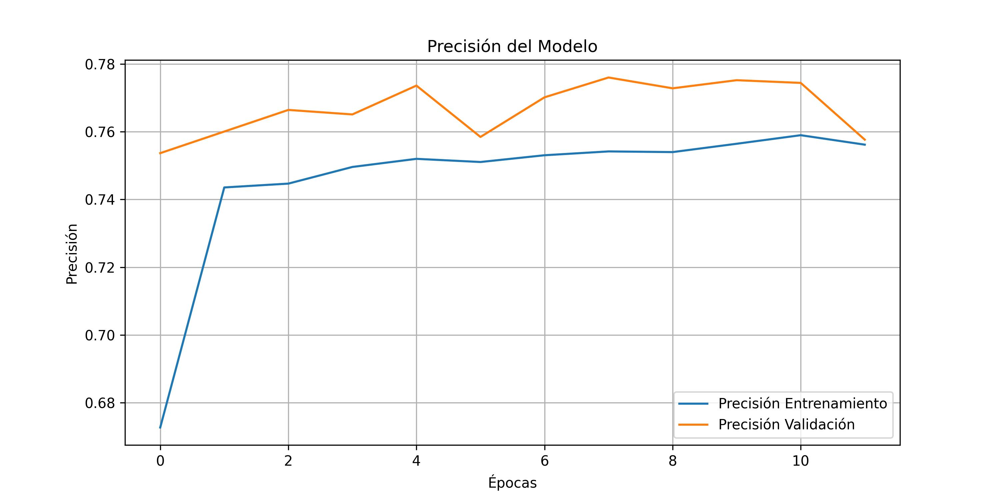

# Waste Classification System using CNN

[](https://www.python.org/)
[](https://www.tensorflow.org/)
[](LICENSE)

## 🌍 Problem
Incorrect waste disposal contributes to environmental pollution and resource mismanagement.  
This project automates waste classification to ensure proper disposal and recycling.

## 💡 Solution
A Convolutional Neural Network (CNN) classifies waste images into multiple categories and maps them to the correct disposal bins.  
Supports **real-time predictions using a webcam** for hands-on demonstration.

## 🛠️ Technologies
- **Programming:** Python  
- **Machine Learning / AI:** TensorFlow, Keras, Convolutional Neural Networks (CNN)  
- **Computer Vision:** OpenCV  
- **Data Analysis & Processing:** NumPy, Matplotlib  
- **Tools:** Git, GitHub, Jupyter Notebook  

## 📊 Dataset
Custom dataset containing images for different waste categories:  
Plastic, Paper, Glass, Metal, Biodegradable, Biological Waste, Cardboard, Food-Contaminated Paper/Cardboard/Napkins.  
Data augmentation and masks were applied to improve generalization.

## 🧠 Model
- CNN architecture (DenseNet121 backbone) for multi-class image classification  
- Image preprocessing and normalization  
- Train/validation split with early stopping and checkpointing  
- Evaluated using **validation accuracy** and **confusion matrix**

## 📈 Model Performance



## 🎥 Demo

[
 
## ✅ Results
- Accurate multi-class waste classification  
- Real-time predictions using webcam input  
- Output mapped to correct disposal bins:  
  - Residuos aprovechables  
  - Residuos no aprovechables  
  - Residuos orgánicos aprovechables  
  - Residuos peligrosos  

## 🚀 How to Run

```bash
# 1. Clone the repository
git clone https://github.com/tuusuario/tu-repo.git
cd tu-repo

# 2. Create a virtual environment
python -m venv venv
# Linux/macOS
source venv/bin/activate
# Windows
venv\Scripts\activate

# 3. Install dependencies
pip install -r requirements.txt

# 4. Train the model (optional, pretrained model included)
python entrenamiento_modelo.py

# 5. Run real-time classification
python main.py

